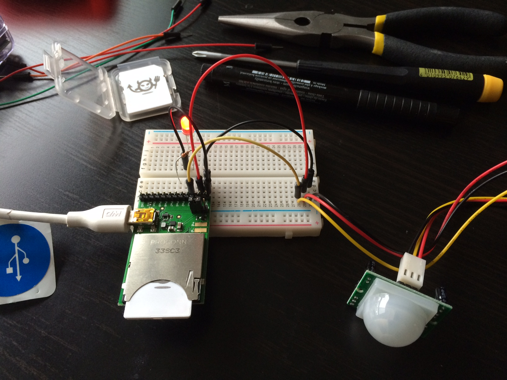
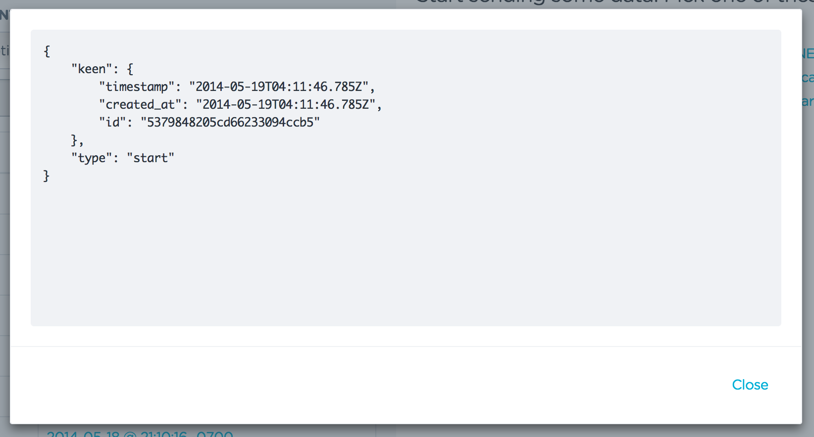
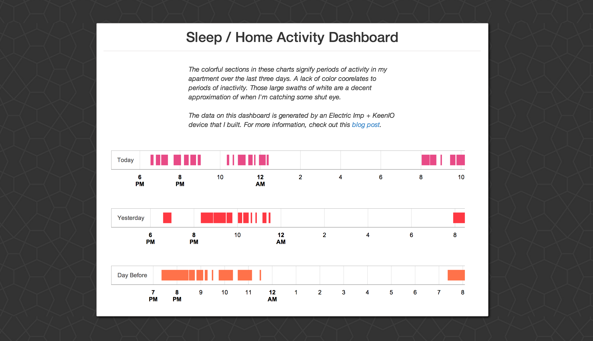

# KeenIO + Electric Imp + PIR Sensor
_A simple Electric Imp device that uses KeenIO to track my sleep schedule_

In a nutshell, my device is just a PIR motion sensor that is connected to an Electric Imp, which in turn, is connected to KeenIO. The PIR motion sensor is a relatively cheap ($10) little sensor that detects changes in levels of infrared radiation (e.g. human movement) within 20 feet. If well-placed (probably wherever you spend the bulk of your time at home), the PIR sensor can tell you when you're active in your home and when you're not. For me, the long periods of inactivity correlate to the times when I'm sleeping or at work.

This repo covers, in order:

1. `led_blink`, an Electric Imp "hello world" with a blinking LED.
2. `pir_sensor`, which uses log statements to test the functionality of a PIR sensor.
3. `pir_events`, where basic motion event data is sent to KeenIO.
4. `dashboard`, where data is visualized.

Materials I used: an Electric Imp, April Board, breadboard, PIR motion sensor, 330 ohm resistor, some wires, an LED (or several) and a [free KeenIO account](https://keen.io/).

## led_blink
To get started, try using this [tutorial](http://electricimp.com/docs/gettingstarted/2-helloworld/) to get an LED blinking.

Pro tip: If your Imp isn't connecting to your Internet network, double check that your wifi password is correct. (Electric Imp won't cue you into the fact that your password is incorrect).

## pir_sensor
To get your PIR sensor connected, check out these pages on [setup](https://learn.adafruit.com/pir-passive-infrared-proximity-motion-sensor/using-a-pir) and [testing](https://learn.adafruit.com/pir-passive-infrared-proximity-motion-sensor/testing-a-pir).

There are six basic steps for this part:

1. Connect the attached red wire to VIN on the April Board.
2. Connect the black wire to the GROUND, right next to VIN.
3. Connect the remaining wire to PIN1.
4. Write your Squirrel device.nut code.
5. Write your Squirrel agent.nut code.
6. Click "Build and Run" in your Imp IDE and check the logs. (You may need to reload the page).

For specific information on configuring digital pins, I used these [two](http://electricimp.com/docs/examples/digitalin-button/) [pages](http://electricimp.com/docs/api/hardware/pin/configure/) from Electric Imp's dev center. I also used [codegirljp's advice](http://codergirljp.blogspot.com/2014/01/electric-imp-hello-world-motion-sensor.html) with regards to using `pin1` and `DIGITAL_IN_WAKEUP`.

## pir_events
Sending your [event data](https://keen.io/blog/53958349217/analytics-for-hackers-how-to-think-about-event-data) to [KeenIO](https://keen.io/) only requires a few small changes to the `pir_sensor` code, detailed above. To begin, take a look at Keen's [getting started guide](https://keen.io/docs/getting-started-guide/) and this super helpful [keenio agent.nut](https://github.com/electricimp/reference/tree/master/webservices/keenio).

1. Create a free KeenIO account and login.
2. Create a new project on KeenIO.
3. Add a [snippet of Keen's code]((https://github.com/electricimp/reference/tree/master/webservices/keenio)) to your agent.nut code.
4. Add your Keen Project ID and your Keen Write API Key to your agent.nut code.
5. Confirm that your device is still connected to your agent (e.g. `agent.send("motion", pir_state);` in device.nut and `device.on("motion", function (state) {` in agent.nut).
6. Click "Build and Run" in your Imp IDE and check the logs. (You may need to reload the page).

Note: Event meta data logged to Keen includes ["timestamp", "created_at" and "id"](https://keen.io/docs/event-data-modeling/event-data-intro/#timestamp-data-type).

##dashboard
For this project, I put together a dashboard that helps me quickly see the past three days of motion recorded in my home. The graphs show periods of activity in a 24 hour time period. I created the graphs using the [timeline chart](https://developers.google.com/chart/) from Google, and doing a bit of data massaging to get Keen’s data to work with the charts.

#### Additional Resources
Electric Imp code is written in Squirrel. For a Squirrel Sublime Text highlighter, check out: [https://github.com/micheg/sublime_squirrel](https://github.com/micheg/sublime_squirrel)
