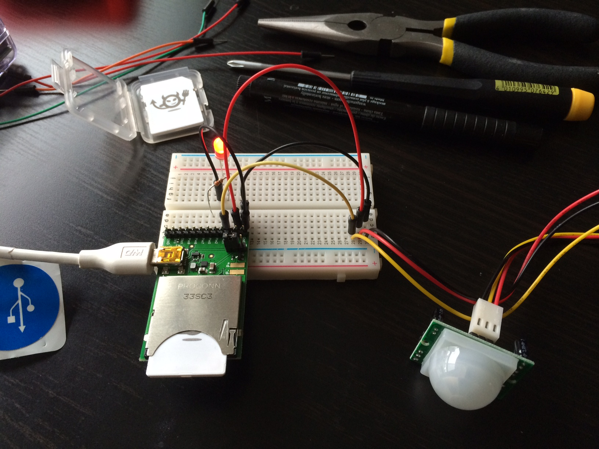
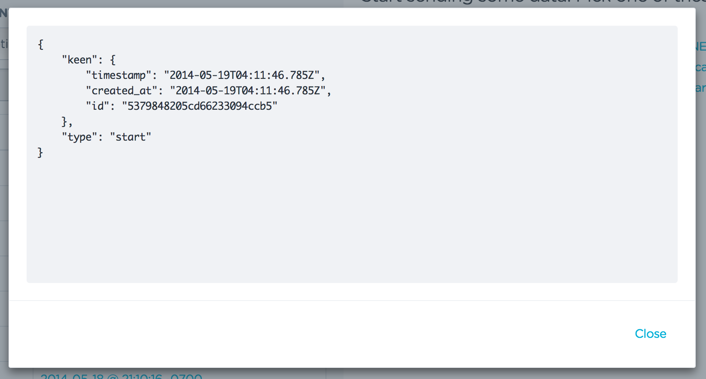

# KeenIO + Electric Imp + PIR Sensor
This repo covers, in order:

1. `led_blink`, an Electric Imp "hello world" with a blinking LED.
2. `pir_sensor`, a PIR sensor "hello world" that prints statements to the IDE log panel.
3. `pir_events`, where basic motion event data is sent to KeenIO.

## led_blink
To start off with your Electric Imp, try using this [tutorial](http://electricimp.com/docs/gettingstarted/2-helloworld/) to get an LED blinking.

Pro tip: If your Imp isn't connecting to your Internet network, double check that your wifi password is correct. (Electric Imp won't cue you into the fact that your password is incorrect).

## pir_sensor
To get your PIR sensor connected, check out these pages on [setup](https://learn.adafruit.com/pir-passive-infrared-proximity-motion-sensor/using-a-pir) and [testing](https://learn.adafruit.com/pir-passive-infrared-proximity-motion-sensor/testing-a-pir).

For specific information on configuring digital pins, I used these [two](http://electricimp.com/docs/examples/digitalin-button/) [pages](http://electricimp.com/docs/api/hardware/pin/configure/) from Electric Imp's dev center. I also used [codegirljp's advice](http://codergirljp.blogspot.com/2014/01/electric-imp-hello-world-motion-sensor.html) with regards to using `pin1` and `DIGITAL_IN_WAKEUP`.

## pir_events
Sending your [event data](https://keen.io/blog/53958349217/analytics-for-hackers-how-to-think-about-event-data) to [KeenIO](https://keen.io/) only requires a few small changes to the `pir_sensor` code, detailed above. To begin, check out the [getting started guide](https://keen.io/docs/getting-started-guide/) and this super helpful [keenio agent.nut](https://github.com/electricimp/reference/tree/master/webservices/keenio).

Note: Event meta data logged to Keen includes ["timestamp", "created_at" and "id"](https://keen.io/docs/event-data-modeling/event-data-intro/#timestamp-data-type).

#### Additional Resources
Electric Imp code is written in Squirrel. For a Squirrel Sublime Text highlighter, check out: [https://github.com/micheg/sublime_squirrel](https://github.com/micheg/sublime_squirrel)
